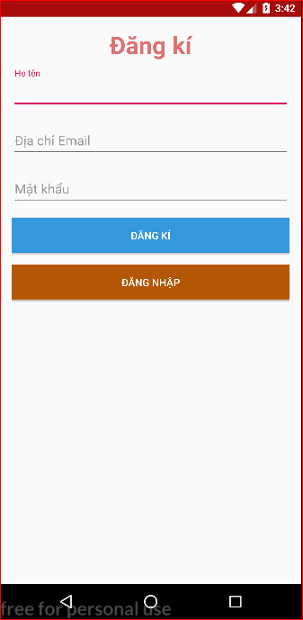
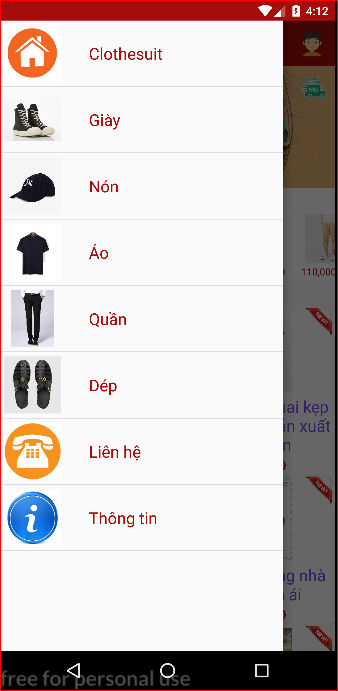
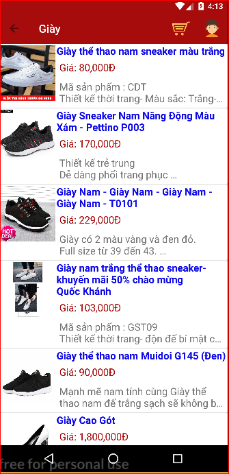
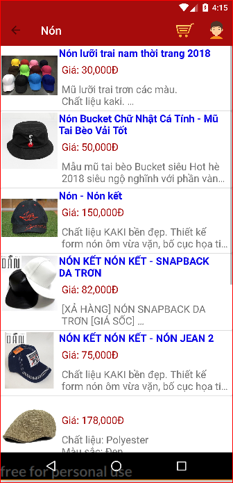
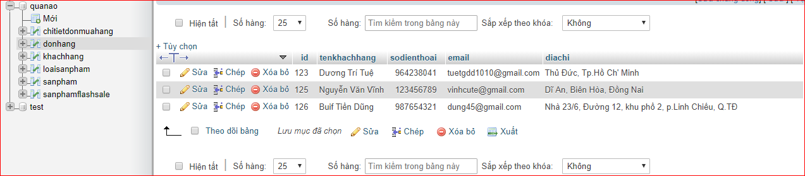
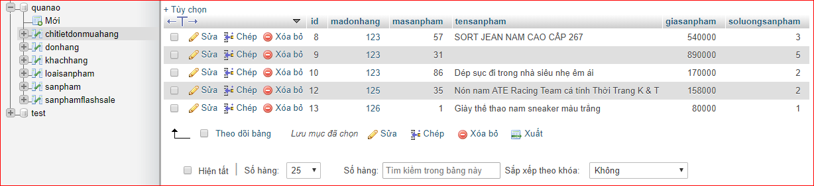

 
   
   
   # MÔN HỌC: *NHẬP MÔN ỨNG DỤNG DI ĐỘNG*
   # TÊN ĐỀ TÀI: *SHOPPING APP*
## THÔNG TIN NHÓM:
   ### Tên nhóm: *FireFox*
   ### Thành viên nhóm:
   - [*Hoàng Văn Châu*](https://www.facebook.com/chau.ducgiang) 16520108
  - [*Dương Trí Tuệ*](https://www.facebook.com/duong.tritue.9)  16521390
  - [*Vũ Ngọc Duy Anh*](https://www.facebook.com/d.a2029)       16520062
   ### Giảng viên hướng dẫn: *Huỳnh Tuấn Anh*
## ĐẶT VẤN ĐỀ
 - Do nhu cầu mua sắm của người Việt ngày càng tăng cao, nhằm nâng cao chất lượng mua sắm và thuận tiện nhất cho người dùng. Chúng tôi đã thiết kế app bán hàng online cho khách hàng, để khách hàng sử dụng và mua hàng online ngay tại nhà và bất cứ nỡi đâu cũng có thể mua được.
 - Để tránh tình trạng chen lấn, xô đẩy, mệt mỏi vào các dip tết, ngày lễ, ngày nghỉ khi shop đăng thông tin giảm giá. Nhằm cải thiện vấn đề nan giải này, đó cũng là mục đích khi chúng tôi thiết kế app này.
 - Tối ưu hóa tốt nhất cho app để người sử dụng có thể sử dụng một cách tốt nhất.
## CÔNG CỤ SỬ DỤNG ĐỂ THIẾT KẾ
  - Android Studio Verson 1.0
  - Language: JavaScrip
  - HeiliSQL: XAMPP Control Panel Verson 7.2.12-0
  - Genymotion Verson 3.0.0
  - Visual Studio Code PHP
 ## CÁC CHỨC NĂNG CHÍNH:
  - Đăng kí tài khoản, đăng nhập
  - Danh sách các loại sản phẩm trong app 
  - Xem danh sách từng sản phẩm
  - Thông tin từng sản phẩm
  - Thông tin khách hàng
  - Danh sách các sản phẩm của khách hàng đặt mua
  - Màn hình xác nhận thông tin khách hàng mua hàng
 ## MÔI TRƯỜNG CÀI ĐẶT
 - Hệ điều hành Android 6.0
 - Min sdk 23
 ## GIAO DIỆN CỦA ỨNG DỤNG  
 ### Đăng nhập / Đăng kí
 - Đăng nhập
 - Đăng kí
 

 
 

 
 ### Giao diện màn hình chính
   

 

 
 ### Danh sách các sản phẩm có ở app
 

 

 
 ### Xem danh sách từng sản phẩm
  

 
 

 
 ### Thông tin từng sản phẩm
  

  
 

 
 ### Danh sách các sản phẩm của khách hàng đặt mua
  

 
 

 
 ### Màn hình xác nhận thông tin khách hàng mua hàng
   

 
 

 
 ### Danh sách khách hàng đặt mua và chi tiết đơn hàng
 

 
   
 

 
   ### Mô tả thông tin khách hàng khi đặt hàng
   
  - Id trong bảng 'donhang' sẽ được tự động tạo khi khách hàng nhấn button xác nhận để thanh toán đơn hàng
  - Thông tin của khách hàng sẽ được hệ thống tự động cập nhật lên Server
  - Thông tin chi tiết các sản phẩm mà khách hàng mua cũng được hệ thống cập nhật lên bảng 'chitietdonmuahang' thông qua khóa của bảng là 'madonhang'.
  - 'Id' là khóa chính trong bảng 'donhang', 'madonhang' là khóa ngoại trong bảng 'chitietdonmuahang'
  - Thông qua 'Id' và 'madonhang' chủ cửa hàng sẽ biết được khách hàng nào đặt sản phẩm nào và đưa đến đúng địa chỉ mà khách hàng đã đặt.
  
  ### Tài liệu tham khảo
  - Trung tâm tin học khoa phạm
  - https://www.mkyong.com 
  - Các nguồn tài liệu tham khảo từ các trang trên web để giúp nhóm có thể hoàn thiện app bán hàng
 
 
 
 

